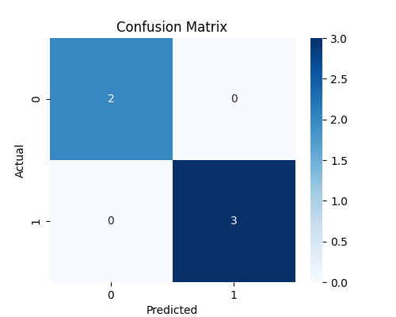

# KNN Custom Dataset Project

A simple KNN classifier built in Google Colab / Jupyter using a custom Excel dataset (study hours, sleep hours → Pass/Fail).

## Files
- `KNN-CustomDataset.ipynb` — notebook with training & evaluation
- `student_dataset.xlsx` — dataset (Excel)
- `knn_model.joblib` — saved KNN model
- `scaler.joblib` — saved StandardScaler
- `confusion_matrix.png` — final evaluation screenshot
- `requirements.txt` — dependencies
- `.gitignore`

## How to run
1. Open `KNN-CustomDataset.ipynb` in Google Colab (or Jupyter).  
2. Upload `student_dataset.xlsx` to Colab (if using Colab).  
3. Run cells: training will produce `knn_model.joblib`, `scaler.joblib`, and `confusion_matrix.png`.

## Result

